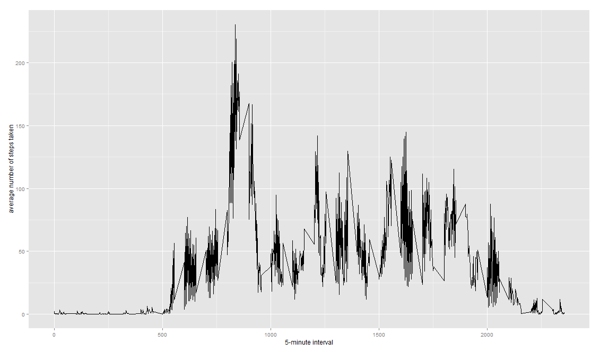
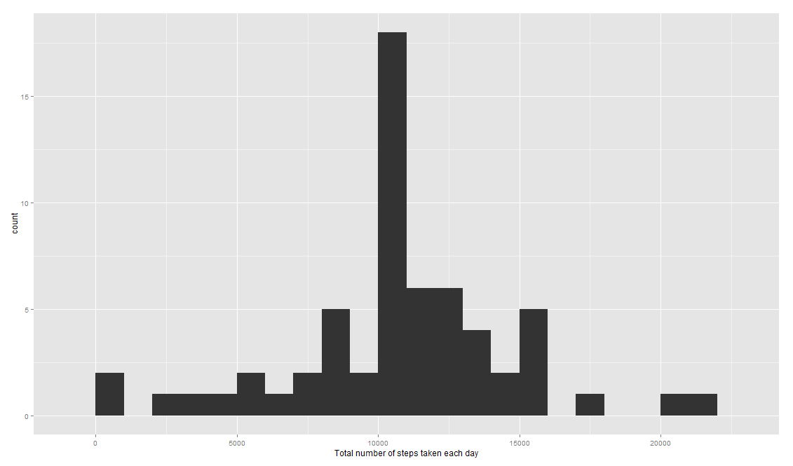
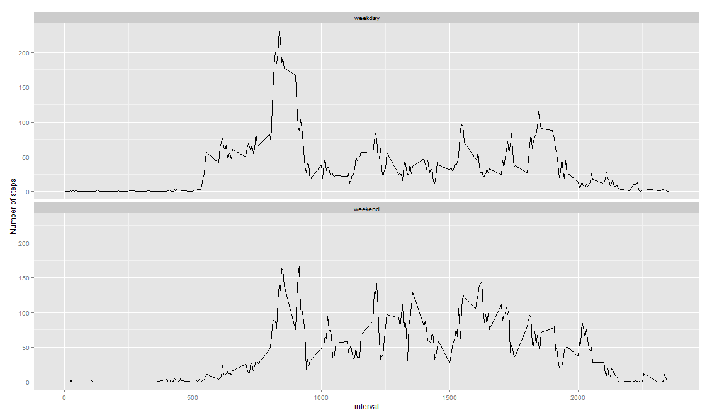

setwd("C:/Users/SemanticPrincess/Desktop/dataSciencecoursera/ReproducibleResearch")

---
title: "Reproducible Research: Peer Assessment 1"
output: 
  html_document:
    keep_md: true
---

## Loading and preprocessing the data

```r
unzip(zipfile="activity.zip")
activity<-read.csv("activity.csv")
```

## What is mean total number of steps taken per day?


```r
library(ggplot2)
totalSteps <- tapply(activity$steps, activity$date, FUN=sum, na.rm=TRUE)
qplot(totalSteps, binwidth=1000, xlab="Total number of steps taken each day")
```

 

```r
mean(totalSteps, na.rm=TRUE)
```

```
## [1] 9354.23
```

```r
median(totalSteps, na.rm=TRUE)
```

```
## [1] 10395
```

## What is the average daily activity pattern?

```r
library(ggplot2)
averages <- aggregate(x=list(steps=activity$steps), by=list(interval=activity$interval),FUN=mean, na.rm=TRUE)
ggplot(data=averages, aes(x=interval, y=steps)) +
        geom_line() +
        xlab("5-minute interval") +
        ylab("average number of steps taken")
```

 

##(Inputting Missing Values)
Note that there are many days/intervals where there are missing values (coded as NA). The presence of missing days may introduce bias 
into some calculations or summaries of the data.

##Calculate and report the total number of missing values in the dataset (i.e. the total number of rows with NA's)

```r
missingData <- is.na(activity$steps)
# How many missing values verses not missing
table(missingData)
```

```
## missingData
## FALSE  TRUE 
## 15264  2304
```

##A strategy to deal with missing data, the missing values are populated with the mean value for that particular 5-minute interval.

```r
# each missing value gets replaced with the mean value of its 5-minute interval
fillMissing <- function(steps, interval) 
{
        fillValue <- NA

        if (!is.na(steps))
                fillValue <- c(steps)
        else
                fillValue <- (averages[averages$interval==interval, "steps"])

return(fillValue)
}


##Create a new dataset that is equal to the original dataset but with the missing data filled in.
activityNoMissing <- activity
#using the fillMissing function just created, in mapply
activityNoMissing$steps <- mapply(fillMissing, activityNoMissing$steps, activityNoMissing$interval)
```

##Make a histogram of the total number of steps taken each day and Calculate and report the mean and median total number of steps taken per day. Do these values differ from the estimates from the first part of the assignment? What is the impact of imputing missing data on the estimates of the total daily number of steps?


```r
totalSteps <- tapply(activityNoMissing$steps, activityNoMissing$date, FUN=sum)
qplot(totalSteps, binwidth=1000, xlab="Total number of steps taken each day")
```

 

```r
mean(totalSteps)
```

```
## [1] 10766.19
```

```r
median(totalSteps)
```

```
## [1] 10766.19
```


The original mean iss: 9354.23 and mean is: 10395.  After imputing the missing values, this results in higher mean and median.  
The impact is that instead of removing the steps with NA we impute a mean as the value for steps so we can incorporate the record
into the analysis.  It's really a heuristic or best guess approach for resolving the missing data problem.


## Are there differences in activity patterns between weekdays and weekends?

Create a new factor variable in the dataset with two levels - "weekday" and "weekend" indicating whether a given date is a weekday or weekend day.


```r
weekdayOrWeekend <- function(date) 
{
        day <- weekdays(date)

        if (day %in% c("Monday", "Tuesday", "Wednesday", "Thursday", "Friday"))
                return("Weekday")

        else if (day %in% c("Saturday", "Sunday"))
                return("Weekend")

        else
                stop("incorrect date")
}


activityNoMissing$date <- as.Date(activityNoMissing$date)
activityNoMissing$day <- sapply(activityNoMissing$date, FUN=weekdayOrWeekend)
```

Make a panel plot containing a time series plot (i.e. type = "l") of the 5-minute interval (x-axis) and the average number of steps taken, averaged across all weekday days or weekend days (y-axis). See the README file in the GitHub repository to see an example of what this plot should look like using simulated data.


```r
averages <- aggregate(steps ~ interval + day, data=activityNoMissing, mean)
ggplot(averages, aes(interval, steps)) + 
        geom_line() + 
        facet_grid(.~ day) +
        facet_wrap( ~ day, ncol=1)+
        xlab("interval") + 
        ylab("Number of steps")
```

 


